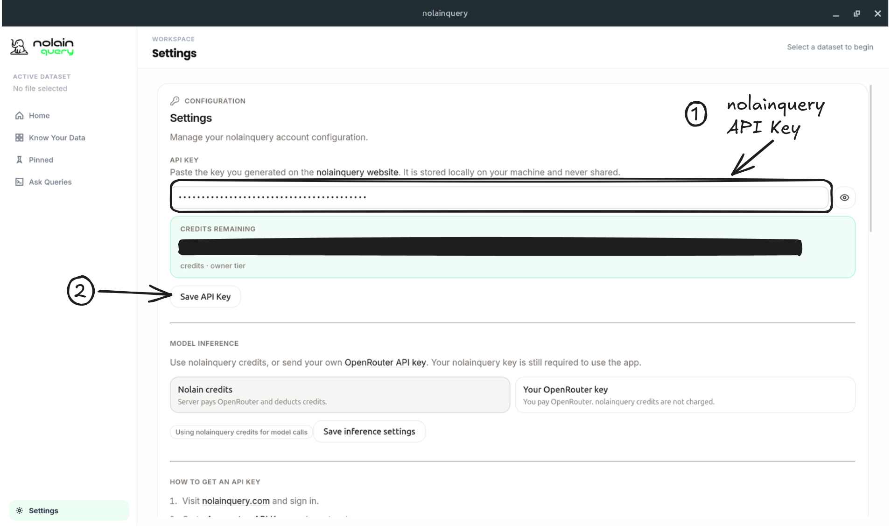
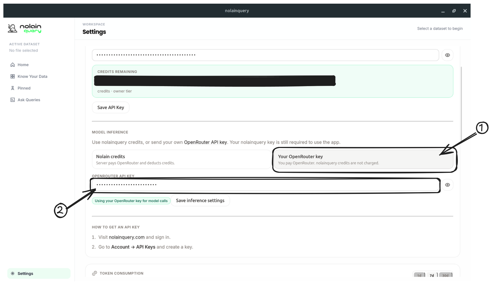
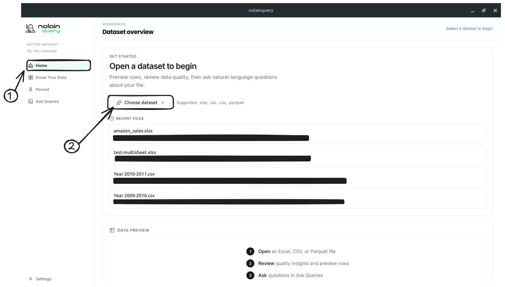
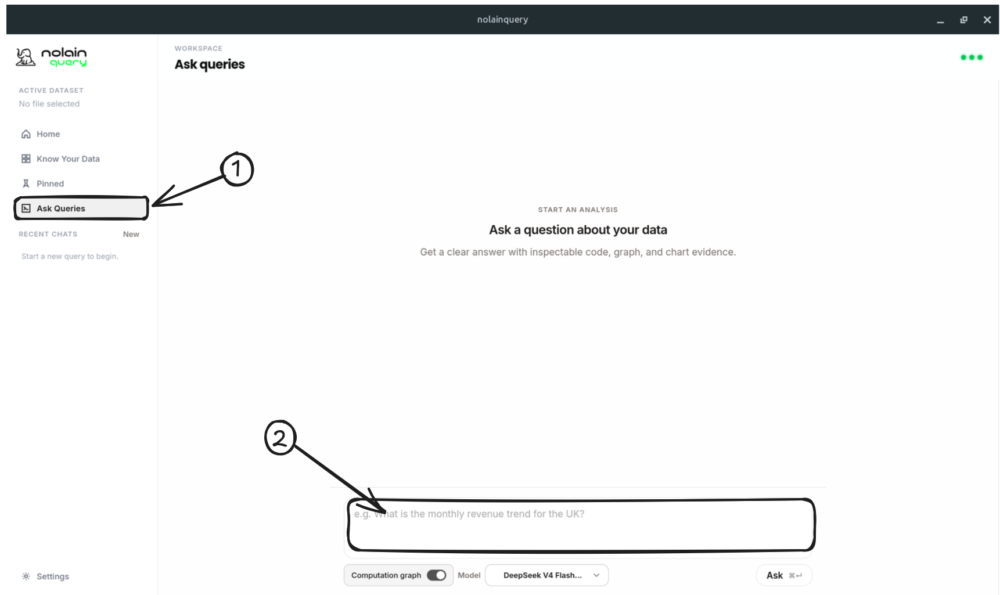

# nolainquery desktop

Open-source desktop client for [nolainquery](https://nolainquery.com).

nolainquery answers questions about a file that already lives on your computer.
You ask something like “What is total revenue by country?”, and you get a table —
and, if you asked for one, a chart — computed from that file.

Your file never leaves the machine. A hosted reasoning service sees only a
**sketch** of the data (column names, types, a few samples) and returns a
**recipe**. Your computer runs the recipe against the real rows.

This repository contains the desktop app and the local Python execution engine.
The hosted API at `https://nolainquery.com` is a separate service.

## Use the app (keys)

Every build path below ends here. You need:

1. A **nolainquery API key** from [nolainquery.com/account](https://nolainquery.com/account)
   (sign in with Google → **Account → API Keys** → **Create key**).
2. An **OpenRouter API key** from [openrouter.ai/keys](https://openrouter.ai/keys).
   Model calls bill your OpenRouter account directly.

Keys stay on your device. Never commit them.

**Upgrading from an older build:** the desktop is OpenRouter-only now. Open
**Settings → Model inference**, paste your OpenRouter key, and choose **Save
inference settings** before asking queries. The credits balance UI is gone.

## Downloads

Prefer a prebuilt binary? Use [GitHub Releases](https://github.com/jdvillegasg/nolainquery-desktop/releases).

| Platform | Artifact | Status |
| --- | --- | --- |
| Linux | `Nolain-Data-Query.AppImage` | Published from `v*` tags |
| Windows | NSIS `.exe` and `.msi` | Published from `v*` tags |
| macOS | — | Not packaged yet; [build from source](#build-from-source-linux-windows-macos) |

Maintainers: see [docs/RELEASING.md](docs/RELEASING.md).

---

## Build from source (Linux, Windows, macOS)

Use this when you want a development window (`tauri dev`) and the local Python
engine running from this checkout.

### Files to change

Copy the frontend env template. This is the file that points the source build
at the hosted service instead of `http://127.0.0.1:8000`:

```text
desktop_app/frontend/.env.example  →  desktop_app/frontend/.env
```

Confirm these two lines (already set in the example):

```dotenv
VITE_CLOUD_API_URL=https://nolainquery.com
VITE_PORTAL_URL=https://nolainquery.com
```

Do not put API keys in that file. Keys are entered in **Settings**.

### Build the Python sidecar

Tauri requires a bundled Python sidecar binary at compile time, even for
`tauri dev`. Development still runs the live Python engine from `launch.sh`
on port 8001; the sidecar binary satisfies the Tauri build only.

Run the sidecar build **once** after installing dependencies (re-run when the
Python engine changes materially). PyInstaller bundling can take several
minutes. The output is gitignored under `desktop_app/frontend/src-tauri/bin/`.

| Platform | Command |
| --- | --- |
| Linux / macOS | `./desktop_app/python_engine/build-sidecar.sh` |
| Windows | `.\desktop_app\python_engine\build-sidecar.ps1` |

The `distribute.sh` and `distribute-windows.ps1` scripts run this step
automatically; you only need it for source development (`launch.sh` /
`launch.ps1`).

### Linux

Debian or Ubuntu with `apt`, Git, and `sudo`:

```bash
git clone https://github.com/jdvillegasg/nolainquery-desktop.git
cd nolainquery-desktop
./setup.sh
./desktop_app/python_engine/build-sidecar.sh
cp desktop_app/frontend/.env.example desktop_app/frontend/.env
./launch.sh
```

On another distro, install [Tauri Linux prerequisites](https://v2.tauri.app/start/prerequisites/)
first, then `python3 -m venv .venv`, `pip install -r requirements.txt`,
`pip install pyinstaller`, `npm install` in `desktop_app/frontend`, and
`./desktop_app/python_engine/build-sidecar.sh`.

Leave the terminal open. `Ctrl+C` stops the UI and the engine on port 8001.

### Windows

Install [Python 3.11+](https://www.python.org/downloads/) (add to PATH),
[Node.js 20+](https://nodejs.org/), [Rust](https://rustup.rs/), and
[Visual Studio Build Tools](https://visualstudio.microsoft.com/visual-cpp-build-tools/)
with the **Desktop development with C++** workload.

In PowerShell:

```powershell
git clone https://github.com/jdvillegasg/nolainquery-desktop.git
cd nolainquery-desktop
.\setup-windows.ps1
.\desktop_app\python_engine\build-sidecar.ps1
Copy-Item desktop_app\frontend\.env.example desktop_app\frontend\.env
.\launch.ps1
```

### macOS

Packaged `.app` / `.dmg` builds are not in this repo yet. Source works:

1. Install Xcode Command Line Tools: `xcode-select --install`
2. Install [Homebrew](https://brew.sh/), then:

```bash
brew install python@3.11 node rust
git clone https://github.com/jdvillegasg/nolainquery-desktop.git
cd nolainquery-desktop
python3 -m venv .venv
source .venv/bin/activate
pip install --upgrade pip setuptools wheel
pip install -r requirements.txt
pip install pyinstaller
(cd desktop_app/frontend && npm install)
./desktop_app/python_engine/build-sidecar.sh
cp desktop_app/frontend/.env.example desktop_app/frontend/.env
./launch.sh
```

### Use the software

1. Open **Settings** in the sidebar.
2. Paste the nolainquery key into **API Key** → **Save API Key**. Wait for the
   active-key badge.

   

3. Under **Model inference**, paste your OpenRouter key → **Save inference
   settings**.

   

4. Open **Home** → **Choose dataset**. Pick a local `.xlsx`, `.xls`, `.csv`,
   or `.parquet` file. For Excel, pick the active table if several sheets appear.

   

5. Open **Ask Queries**, type a question about a real column, press
   `Ctrl+Enter` (Linux/Windows) or `Command+Enter` (macOS).

   

More detail: [docs/GETTING_STARTED.md](docs/GETTING_STARTED.md).

---

## Build from `setup.sh` and `distribute.sh` (Linux)

Use this to produce a **zero-install AppImage** that you can move anywhere and
double-click. The hosted API URL is baked in by `distribute.sh`
(`https://nolainquery.com`). You do not edit `.env` for this path.

```bash
git clone https://github.com/jdvillegasg/nolainquery-desktop.git
cd nolainquery-desktop
./setup.sh
./distribute.sh
```

If AppImage bundling hangs, install FUSE:

```bash
sudo apt install libfuse2
```

The file is written to:

```text
./Nolain-Data-Query.AppImage
```

Make it executable and run it:

```bash
chmod +x Nolain-Data-Query.AppImage
./Nolain-Data-Query.AppImage
```

To point a **staging** build at a different host, do **not** edit
`.env.example`. Override at build time:

```bash
NOLAIN_CLOUD_API_URL=https://nolainquery.com NOLAIN_PORTAL_URL=https://nolainquery.com ./distribute.sh
```

### Use the software

The AppImage already talks to `https://nolainquery.com`. There is no `.env` to
edit after the build.

---

## Build from `distribute-windows.ps1` (Windows)

Use this to produce Windows installers (NSIS `.exe` for a guided setup, `.msi`
for enterprise). The script bakes `https://nolainquery.com` into the UI at
build time. You do not edit `.env` for a normal release.

Prerequisites: Python 3.11+, Node.js 20+, Rust, MSVC Build Tools.

```powershell
git clone https://github.com/jdvillegasg/nolainquery-desktop.git
cd nolainquery-desktop
.\distribute-windows.ps1
```

Installers are copied to:

```text
dist\windows\
```

Run the `.exe` (or `.msi`), then start **nolainquery** from the Start menu.

Staging override (PowerShell):

```powershell
$env:NOLAIN_CLOUD_API_URL = "https://nolainquery.com"
$env:NOLAIN_PORTAL_URL = "https://nolainquery.com"
.\distribute-windows.ps1
```

---

## Repository layout

| Path | Purpose |
| --- | --- |
| `desktop_app/frontend/` | Tauri + React UI |
| `desktop_app/python_engine/` | Local sidecar that reads files and executes generated code |
| `desktop_app/python_engine/build-sidecar.sh` | Bundle the Python engine for Tauri (Linux / macOS source builds) |
| `desktop_app/python_engine/build-sidecar.ps1` | Bundle the Python engine for Tauri (Windows source builds) |
| `packages/query_execution/` | Restricted Pandas execution sandbox |
| `packages/query_operations/` | Shared computation-graph operation registry |
| `setup.sh` / `launch.sh` | Linux source setup and dev launch |
| `setup-windows.ps1` / `launch.ps1` | Windows source setup and dev launch |
| `distribute.sh` | Linux AppImage |
| `distribute-windows.ps1` | Windows installers |

## Documentation

- [Getting started](docs/GETTING_STARTED.md)
- [Try locally](docs/TRY_LOCALLY.md)
- [Desktop workflows](docs/DESKTOP_WORKFLOWS.md)
- [Excel and workbooks](docs/EXCEL_AND_WORKBOOKS.md)
- [Troubleshooting](docs/TROUBLESHOOTING.md)
- [Screenshot replacements](docs/images/SCREENSHOTS.md)

## License

[Polyform Noncommercial License 1.0.0](LICENSE). You may use, modify, and
share this software for **noncommercial** purposes only. Commercial use
requires separate permission from the copyright holder.

## Security

See [SECURITY.md](SECURITY.md).
