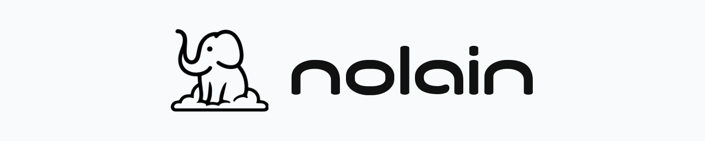

<p align="center">
  <a href="https://nolain.tech">
    
  </a>
</p>

<h1 align="center">nolainquery</h1>

<p align="center">
  Open-source desktop client from
  <a href="https://nolain.tech">nolain</a>
  for
  <a href="https://nolainquery.com">nolainquery</a>.
</p>

---

<p align="center">
  <a href="#purpose">🎯 Purpose</a>
  &nbsp;·&nbsp;
  <a href="#keys">🔑 Keys</a>
  &nbsp;·&nbsp;
  <a href="#downloads">📦 Downloads</a>
  &nbsp;·&nbsp;
  <a href="#first-run">▶️ First run</a>
  &nbsp;·&nbsp;
  <a href="#build-from-source">🛠️ Build</a>
  &nbsp;·&nbsp;
  <a href="#repository-layout">📁 Layout</a>
  &nbsp;·&nbsp;
  <a href="#documentation">📚 Docs</a>
  &nbsp;·&nbsp;
  <a href="#license">⚖️ License</a>
</p>

---

<p align="center">
  <a href="https://github.com/jdvillegasg/nolainquery-desktop/releases"></a>
  <a href="#downloads"></a>
  <a href="#downloads"></a>
  <a href="#build-from-source"></a>
  <a href="LICENSE"></a>
  <a href="https://jdvillegasg.github.io/nolain-query-docs/"></a>
</p>

## Purpose

nolainquery answers **natural-language queries** about a file that already lives on your computer — for example, “What is total revenue by country?” — and returns **auditable artifacts** so you can inspect the computation that produced the answer: generated Pandas code (runnable as notebook cells), an optional computation graph, and an optional chart.

Your file never leaves the machine. A hosted reasoning service sees only a **sketch** of the data (column names, types, a few samples) and returns a **recipe**. The desktop runs that recipe locally against the real rows.

This repository is the desktop app and the local Python execution engine. The hosted API at [nolainquery.com](https://nolainquery.com) is a separate service. For the privacy split, capabilities, and end-to-end flow, see the [documentation](https://jdvillegasg.github.io/nolain-query-docs/).

Today the product covers descriptive analysis of **one active table** (CSV, Parquet, or one Excel sheet): aggregations, comparisons, rankings, trends, quality checks, transformations, and optional charts.

## Keys

Every run — download or source — needs two keys, entered in **Settings**. They stay on this device.

1. A **nolainquery API key** from [nolainquery.com/account](https://nolainquery.com/account) (sign in with Google → **Account → API Keys** → **Create key**).
2. An **OpenRouter API key** from [openrouter.ai/keys](https://openrouter.ai/keys). Model calls bill your OpenRouter account directly.

**Upgrading from an older build:** the desktop is OpenRouter-only. Open **Settings → Model inference**, paste your OpenRouter key, and choose **Save inference settings** before asking queries.

## Downloads

Prefer a prebuilt binary? Use [GitHub Releases](https://github.com/jdvillegasg/nolainquery-desktop/releases). Maintainers: [docs/RELEASING.md](docs/RELEASING.md).

| Platform | Artifact | Status |
| --- | --- | --- |
| Linux | `Nolain-Data-Query.AppImage` | Published from `v*` tags |
| Windows | NSIS `.exe` and `.msi` | Published from `v*` tags |
| macOS | — | Not packaged yet; [build from source](#build-from-source) |

> **Windows:** Defender and other antivirus tools may interrupt the unsigned installer. **Turn antivirus off while you install**, then turn it back on before you start the app.

## First run

1. Open **Settings**. Paste the nolainquery key into **API Key** → **Save API Key**. Wait for the active-key badge.

   

2. Under **Model inference**, paste your OpenRouter key → **Save inference settings**.

   

3. Open **Home** → **Choose dataset**. Pick a local `.xlsx`, `.xls`, `.csv`, or `.parquet` file. For Excel, pick the active table if several sheets appear.

   

4. Open **Ask Queries**, type a question about a real column, press `Ctrl+Enter` (Linux/Windows) or `Command+Enter` (macOS). Inspect **Code**, and optionally **Graph** or **Dashboard**, to audit how the answer was computed.

   

More detail: [docs/GETTING_STARTED.md](docs/GETTING_STARTED.md).

## Build from source

Use this for a development window (`tauri dev`) with the local Python engine running from this checkout. Source builds talk to [https://nolainquery.com](https://nolainquery.com) by default; keys are still entered in **Settings**, not in env files.

Tauri needs a bundled Python sidecar at compile time, even for `tauri dev`. Development still runs the live engine from `launch.sh` / `launch.ps1` on port 8001; the sidecar binary only satisfies the compile check. Build it **once** after setup (re-run when the Python engine changes). Output is gitignored under `desktop_app/frontend/src-tauri/bin/`.

| Platform | Sidecar |
| --- | --- |
| Linux / macOS | `./desktop_app/python_engine/build-sidecar.sh` |
| Windows | `.\desktop_app\python_engine\build-sidecar.ps1` |

`distribute.sh` and `distribute-windows.ps1` run this step for you.

### Linux

Debian or Ubuntu with `apt`, Git, and `sudo`:

```bash
git clone https://github.com/jdvillegasg/nolainquery-desktop.git
cd nolainquery-desktop
./setup.sh
./desktop_app/python_engine/build-sidecar.sh
./launch.sh
```

On another distro, install [Tauri Linux prerequisites](https://v2.tauri.app/start/prerequisites/) first, then `python3 -m venv .venv`, `pip install -r requirements.txt`, `pip install pyinstaller`, `npm install` in `desktop_app/frontend`, and the sidecar script above.

Leave the terminal open. `Ctrl+C` stops the UI and the engine on port 8001.

### Windows

Install [Python 3.11+](https://www.python.org/downloads/) (add to PATH), [Node.js 20+](https://nodejs.org/), [Rust](https://rustup.rs/), and [Visual Studio Build Tools](https://visualstudio.microsoft.com/visual-cpp-build-tools/) with the **Desktop development with C++** workload.

```powershell
git clone https://github.com/jdvillegasg/nolainquery-desktop.git
cd nolainquery-desktop
.\setup-windows.ps1
.\desktop_app\python_engine\build-sidecar.ps1
.\launch.ps1
```

### macOS

Packaged `.app` / `.dmg` builds are not in this repo yet. Source works:

1. Install Xcode Command Line Tools: `xcode-select --install`
2. Install [Homebrew](https://brew.sh/), then:

```bash
brew install python@3.11 node rust
git clone https://github.com/jdvillegasg/nolainquery-desktop.git
cd nolainquery-desktop
python3 -m venv .venv
source .venv/bin/activate
pip install --upgrade pip setuptools wheel
pip install -r requirements.txt
pip install pyinstaller
(cd desktop_app/frontend && npm install)
./desktop_app/python_engine/build-sidecar.sh
./launch.sh
```

### Linux AppImage

Zero-install binary; the hosted API URL is baked in (`https://nolainquery.com`):

```bash
git clone https://github.com/jdvillegasg/nolainquery-desktop.git
cd nolainquery-desktop
./setup.sh
./distribute.sh
chmod +x Nolain-Data-Query.AppImage
./Nolain-Data-Query.AppImage
```

If AppImage bundling hangs, install FUSE: `sudo apt install libfuse2`.

Staging host (do not edit env files): `NOLAIN_CLOUD_API_URL=… NOLAIN_PORTAL_URL=… ./distribute.sh`.

### Windows installers

NSIS `.exe` for a guided setup, `.msi` for enterprise. Prerequisites match the Windows source section.

```powershell
git clone https://github.com/jdvillegasg/nolainquery-desktop.git
cd nolainquery-desktop
.\distribute-windows.ps1
```

Installers land in `dist\windows\`. Run the `.exe` or `.msi`, then start **nolainquery** from the Start menu.

Staging host (PowerShell): set `$env:NOLAIN_CLOUD_API_URL` and `$env:NOLAIN_PORTAL_URL`, then run `.\distribute-windows.ps1`.

## Repository layout

| Path | Purpose |
| --- | --- |
| `desktop_app/frontend/` | Tauri + React UI |
| `desktop_app/python_engine/` | Local sidecar that reads files and executes generated code |
| `packages/query_execution/` | Restricted Pandas execution sandbox |
| `packages/query_operations/` | Shared computation-graph operation registry |
| `setup.sh` / `launch.sh` | Linux source setup and dev launch |
| `setup-windows.ps1` / `launch.ps1` | Windows source setup and dev launch |
| `distribute.sh` | Linux AppImage |
| `distribute-windows.ps1` | Windows installers |

## Documentation

The full product book is at **[jdvillegasg.github.io/nolain-query-docs](https://jdvillegasg.github.io/nolain-query-docs/)**.

In this repository:

- [Getting started](docs/GETTING_STARTED.md)
- [Try locally](docs/TRY_LOCALLY.md)
- [Desktop workflows](docs/DESKTOP_WORKFLOWS.md)
- [Excel and workbooks](docs/EXCEL_AND_WORKBOOKS.md)
- [Troubleshooting](docs/TROUBLESHOOTING.md)

## License

[MIT](LICENSE).
